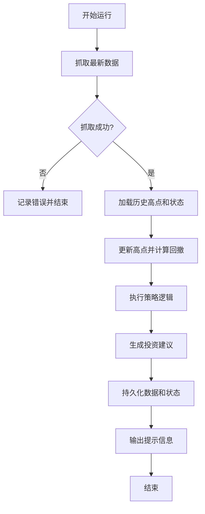

# DESIGN_获取纳指100PE

## 1. 整体架构
系统采用模块化设计，流程如下：
`Fetcher` -> `Data Model` -> `HistoryManager` -> `StrategyEngine` -> `Notifier`

## 2. 核心组件

### 2.1 Fetcher (数据抓取)
- 负责请求蛋卷 API。
- 解析纳指100 (代码通常为 NDX 或对应的蛋卷内部 ID)。
- 返回当前 PE (pe_ttm) 和当前值 (value)。

### 2.2 HistoryManager (历史管理)
- 存储路径: `data/nasdaq_history.csv` (字段: date, pe, value, high, drawdown)。
- 存储路径: `data/state.json` (记录当前最高点 `max_value`，以及已赎回的状态等)。
- 功能: 更新历史记录，更新最高点。

### 2.3 StrategyEngine (策略引擎)
- 输入: 当前 PE, 当前值, 历史最高值。
- 逻辑:
    1. 计算回撤: `(max_value - current_value) / max_value`。
    2. **回撤加码规则**: 检查回撤是否 >= 6%, 8%, ... 30%。如果是，确定定投金额。
    3. **基础定投规则**: 如果没有触发回撤加码，检查 PE 区间 (32-36, 36-38, >=38)。
    4. **赎回止盈规则**: 检查 PE 是否 >= 40, 42, 45。
    5. **买回规则**: 检查 PE 是否 <= 35。
- 输出: 建议操作指令。

### 2.4 Notifier (提示模块)
- 格式化输出到控制台。
- 支持简单的日志记录。

## 3. 核心流程图 (Mermaid)

## 4. 异常处理
- 网络超时/API失败: 重试3次，失败则发送错误提示。
- 数据格式变更: 验证核心字段 (pe, value) 存在。
- 文件读写错误: 检查权限和路径。
