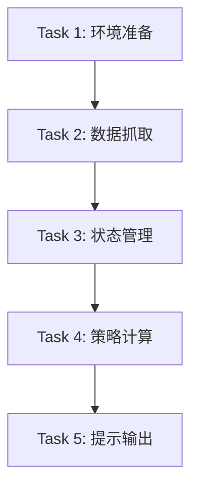

# TASK_获取纳指100PE

## 1. 原子任务拆分

### Task 1: 基础环境与配置准备
- **输入**: 无
- **输出**: `data/` 目录, `requirements.txt` (requests, pandas)。
- **验收标准**: 目录结构建立，依赖可安装。

### Task 2: 数据抓取模块实现
- **输入**: 蛋卷 API URL。
- **输出**: 包含纳指100最新 PE 和点位的字典。
- **验收标准**: 运行脚本能正确提取 `pe` 和 `value`。

### Task 3: 历史数据与状态持久化模块
- **输入**: 最新抓取数据。
- **输出**: 更新后的 `data/nasdaq_history.csv` 和 `data/state.json`。
- **验收标准**: 能正确记录最高点，回撤计算准确。

### Task 4: 策略引擎实现 (核心)
- **输入**: PE, 当前值, 回撤值。
- **输出**: 定投金额或赎回建议字符串。
- **实现约束**: 严格遵循 `bs.md` 中的金字塔规则，注意优先级（回撤 > PE）。
- **验收标准**: 覆盖所有 `bs.md` 中的区间分支。

### Task 5: 提示与自动化集成
- **输入**: 策略建议。
- **输出**: 控制台美化输出。
- **验收标准**: 输出信息包含所有必要指标。

## 2. 依赖图 (Mermaid)

